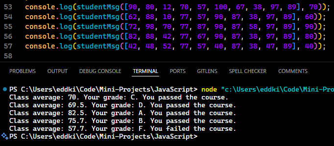

# Mini Project: GradeBook App

## Description

This **JavaScript-based project** calculates the average score for a class and generates a personalized message for a student based on their individual score. It determines whether the student passed or failed, assigns a grade based on their score, and compares it to the class's average. The output is logged to the console. _#freeCodeCamp JavaScript Algorithms and Data Structures Projects_

### Example Output

## Features

-   **Score Calculation**
    -   Calculates the average score of all students in the class.
-   **Grade Assignment**
    -   Assigns grades based on the student's score.
-   **Passing Check**
    -   Determines whether the student has passed based on their grade.
-   **Personalized Feedback**
    -   Generates a message with the student's grade, the class average, and a pass/fail outcome.

## How To Use

1. Open the file in a JavaScript environment (e.g., Node.js, browser console).
2. Call the `studentMsg` function with:
    - `totalScores` - An array of all student scores.
    - `studentScore` - The student's individual score.
3. Run the script to see the output in the console.

## Disclaimer

This project is part of the **JavaScript Algorithms and Data Structures Projects** on freeCodeCamp. The original project tutorial can be found [here](https://www.freecodecamp.org/learn/javascript-algorithms-and-data-structures-v8/).

_Don't forget to star ⭐ this repo is you liked or found it useful_
